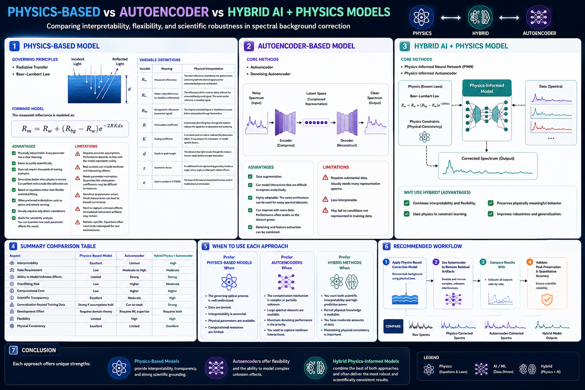
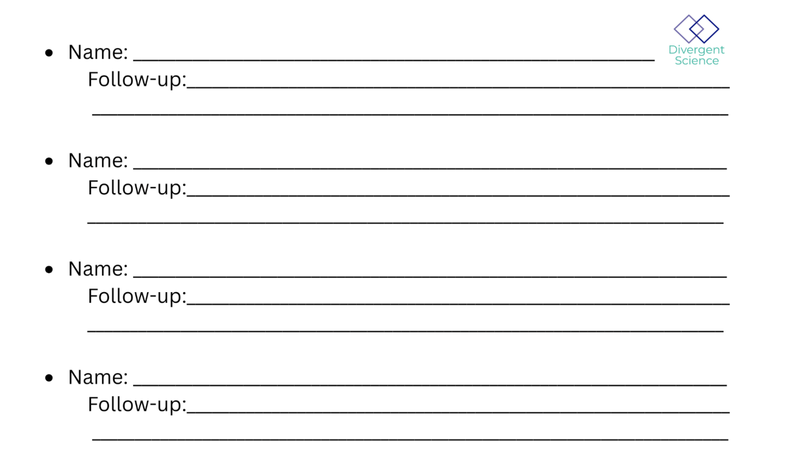

# Integrating AI Tools with Physics-based Models

## Introduction

Spectral measurements acquired from spectrometers often contain unwanted signal components arising from background reflectance, absorption, scattering, and instrument-related artifacts. These interfering contributions can obscure the true spectral signature of the target material and reduce the accuracy of downstream analyses such as material identification, quantitative estimation, and machine learning-based prediction. On the other hand, using machine learning is not a suitable option either. We are dealing with physics in this problem, and traditional AI approaches are not robust enough. Their output is not reliable enough. Furthermore, we need a considerable amount of data to train the model to learn this physics, and there is still no guarantee that the model will be unbiased and reliable. So to answer this question we would like to explore that in what ways can AI tools and physics-based models can complement each other to mitigate their weaknesses.

It can be accomplished in two ways. First, incorporating physics into AI models can lead to more realistic predictions and reduce the computational cost of physics-based models. Alternatively, AI tools can be employed to explore and address potential weaknesses in physics-based models. For instance, we can augment the input data of physics-based models to meet their data requirements. Additionally, if we encounter systematic bias in our data due to human or machine error during data collection, AI can help address these issues. Furthermore, simulations generated by physics-based models are often difficult to interpret and require rigorous data analysis to analyze, visualize, or extract useful information from them. AI tools can assist in interpreting these physics-based simulations and supporting the data analysis process.

This project presents a physics-based signal correction framework for removing unwanted background contributions from measured spectra. The approach is grounded in the principles of radiative transfer and the Beer–Lambert Law, which describe how electromagnetic radiation is attenuated as it propagates through an absorbing and scattering medium. By explicitly modeling the physical processes that alter the signal, the method provides a transparent and scientifically interpretable alternative to purely data-driven denoising techniques.

---

## Forward Model

The measured reflectance spectrum is modeled as:

```math
R_m(\lambda) = R_w(\lambda) + \left(R_{bg}(\lambda) - R_w(\lambda)\right)e^{-2K_d(\lambda)z}
```

---

## Variable Definitions

| Variable | Description |
|--------|--------|
| `R_m(\lambda)` | Reflectance measured by the spectrometer at wavelength `\lambda` |
| `R_w(\lambda)` | Baseline reflectance of the medium at wavelength `\lambda` |
| `R_{bg}(\lambda)` | Unwanted background signal before attenuation at wavelength `\lambda` |
| `K_d(\lambda)` | Diffuse attenuation coefficient at wavelength `\lambda` |
| `z` | Optical path length or depth |
| `\lambda` | Wavelength |
| `e` | Euler's number (`2.71828...`) |

---

## Physical Interpretation

The model assumes that the unwanted background signal (`R_{bg}(\lambda)`) is attenuated as light propagates through an absorbing and scattering medium.

1. The unwanted signal originates from a background source.
2. The signal is reduced according to the exponential attenuation term.
3. The attenuated signal is combined with the baseline reflectance (`R_w(\lambda)`).
4. The resulting spectrum is recorded as the measured reflectance (`R_m(\lambda)`).

This behavior is consistent with the Beer–Lambert Law and radiative transfer theory.

---

## Inverse Model

Rearranging the forward model yields an analytical solution for estimating the original unwanted signal:

```math
R_{bg}(\lambda) = R_w(\lambda) + \left(R_m(\lambda) - R_w(\lambda)\right)e^{2K_d(\lambda)z}
```

This inverse formulation enables the recovery and subsequent removal of background contributions from the measured spectrum.

> **Note:** The exponent is positive (`e^{2K_d(\lambda)z}`) when solving algebraically for `R_{bg}(\lambda)`.

---

## Why This Is a Physics-Based Model

This approach is considered physics-based because:

- It is derived from radiative transfer principles.
- All parameters have physical meaning.
- It uses exponential attenuation consistent with known optical laws.
- It does not rely solely on statistical fitting or black-box learning.

---

## Key Features

Unlike purely data-driven machine learning approaches, the proposed model:

- Uses physically meaningful parameters.
- Can be applied effectively with limited data.
- Is computationally efficient.
- Produces reproducible results.
- Provides strong scientific interpretability.
- Supports sensitivity analysis.

---

## Advantages

- **Physically interpretable**  
  Every parameter has a clear scientific meaning.

- **Works with small datasets**  
  Does not require large amounts of training data.

- **Generalizes well when assumptions are valid**  
  Can perform well beyond the calibration dataset.

- **Transparent and reproducible**  
  Researchers can inspect and validate each assumption.

- **Low risk of overfitting**  
  Based on analytical equations rather than highly flexible models.

- **Computationally efficient**  
  Requires only direct mathematical calculations.

---

## Limitations

- **Requires accurate assumptions**  
  Performance depends on how well the model represents reality.

- **May oversimplify complex systems**  
  Real environments may contain nonlinear interactions.

- **Needs parameter estimation**  
  Attenuation coefficients may be difficult to determine.

- **Sensitive to parameter errors**  
  Small inaccuracies can lead to biased corrections.

- **May miss unknown effects**  
  Instrument artifacts or unexpected phenomena may remain.

---

## Applications

This framework is well suited for:

- Spectroscopy
- Remote sensing
- Water quality analysis
- Optical attenuation studies
- Background signal removal
- Spectral preprocessing

---

## Hybrid Physics-Informed Autoencoder

To further enhance performance, this project also explores a **hybrid physics-informed autoencoder** that combines the interpretability of the analytical model with the flexibility of deep learning.

In this hybrid approach, the physics-based correction is used either as:

- A preprocessing step before neural network training, or
- A physical constraint incorporated into the loss function.

This enables robust removal of both known and unknown spectral artifacts.

---

## Project Goal

The goal of this project is to develop a scientifically grounded and scalable solution for spectral signal correction by integrating first-principles modeling with modern machine learning techniques.

---

## Conclusion

This project provides a transparent and scientifically rigorous framework for removing unwanted spectral signals. By combining physical modeling with optional machine learning enhancements, the approach offers both interpretability and high-performance spectral correction.

# Spectral Signal Correction Approaches

Fong: What are the current issues/weakness during spectral signal correction with traditional physics-based model? Will the ML or AI tools be able improve those weakness (with the strenghs of ML models)? In which ways (improve which parts of the physics models?) will we use to improve the weakness of physics-based model?

This document compares three major approaches for removing unwanted signals from spectrometer data:

1. Physics-Based Model
2. Autoencoder-Based Model
3. Hybrid Physics + Autoencoder (Physics-Informed Neural Network)

---

## 1. Physics-Based Model

### Governing Principles

- Radiative Transfer
- Beer–Lambert Law

## Forward Model

The measured reflectance is modeled as:

R_m = R_w + (R_{bg} - R_w)e^{-2RKdz}

## Variable Definitions

| Variable | Meaning | Physical Interpretation |
|--------|--------|--------|
| `R_m` | Measured reflectance | The total reflectance recorded by the spectrometer, containing both the desired signal and the unwanted background contribution. |
| `R_w` | Water-only reflectance (or baseline reflectance) | The reflectance of the medium alone, without the unwanted background signal. This serves as the reference or baseline signal. |
| `R_bg` | Background reflectance (unwanted signal) | The original unwanted signal or interference source before attenuation through the medium. |
| `R` | Attenuation coefficient | A parameter describing how strongly the medium reduces the signal due to absorption and scattering. |
| `K` | Scaling coefficient | A constant used to scale or calibrate the attenuation effect. It may account for instrument- or model-specific factors. |
| `d` | Depth or path length | The distance that light travels through the medium. Greater values lead to stronger attenuation. |
| `z` | Geometric factor | An additional factor representing geometry, incidence angle, sensor angle, or other path-related effects. |
| `e` | Euler's number (`≈ 2.71828`) | The base of the natural exponential function used to model physical attenuation. |

---

### Advantages

- **Physically interpretable**
  - Every parameter has a clear meaning.
  - Easier to justify scientifically.

- **Works with small datasets**
  - Does not require thousands of training examples.

- **Generalizes better when physics is correct**
  - Can perform well outside the calibration set.

- **Transparent and reproducible**
  - Other researchers can inspect and validate each assumption.

- **Less risk of overfitting**
  - Based on equations rather than flexible statistical fitting.

- **Scientifically credible**
  - Often preferred in disciplines such as optics and remote sensing.

- **Computationally efficient**
  - Usually requires only direct calculations.

- **Useful for sensitivity analysis**
  - You can examine how each parameter affects the result.

### Limitations

- **Requires accurate assumptions**
  - Performance depends on how well the model represents reality.

- **May oversimplify**
  - Real systems can include nonlinear and interacting effects.

- **Needs parameter estimation**
  - Quantities like attenuation coefficients may be difficult to measure.

- **Sensitive to parameter errors**
  - Small inaccuracies can lead to biased corrections.

- **Hard to capture unknown effects**
  - Unmodeled instrument artifacts may remain.

- **Domain-specific**
  - Equations often need to be redesigned for new environments.

---

## 2. Autoencoder-Based Model

### Core Methods

- Autoencoder
- Denoising Autoencoder

### Advantages

- **Learns complex nonlinear relationships**
  - Can model interactions that are difficult to express analytically.

- **Handles unknown artifacts**
  - Can suppress contamination even when the mechanism is not fully understood.

- **Minimal manual modeling**
  - No need to derive equations.

- **Highly adaptable**
  - The same architecture can be used for many spectral datasets.

- **Can improve with more data**
  - Performance often scales as the dataset grows.

- **Supports unsupervised and self-supervised learning**
  - Useful when clean targets are limited.

- **Integrates easily with downstream ML tasks**
  - Denoising and feature extraction can be combined.

### Limitations

- **Requires substantial data**
  - Usually needs many representative spectra.

- **Less interpretable**
  - Internal latent variables may not have physical meaning.

- **Risk of overfitting**
  - Especially when data are limited.

- **May remove weak real peaks**
  - Important but subtle features can be suppressed.

- **Needs hyperparameter tuning**
  - Architecture and training choices strongly affect results.

- **Computationally more expensive**
  - Training can require significant time and hardware.

- **Potentially poor extrapolation**
  - May fail on conditions not represented in training data.

---

## 3. Hybrid Physics + Autoencoder

### Core Method

- Physics-Informed Neural Network (PINN)
- Physics-Informed Autoencoder

### Advantages

- Combines interpretability and flexibility.
- Uses physics to constrain learning.
- Often requires less data than purely data-driven models.
- Preserves physically meaningful behavior.
- Improves robustness and generalization.

### Limitations

- More complex to design and validate.
- Requires expertise in both modeling and machine learning.
- Loss functions and training procedures can be more difficult to tune.
- Development and debugging may take longer.

---

## Summary Table

| Aspect | Physics-Based Model | Autoencoder | Hybrid Physics + Autoencoder |
|------|------|------|------|
| Interpretability | Excellent | Limited | High |
| Data Requirement | Low | Moderate to High | Moderate |
| Ability to Model Unknown Effects | Limited | Strong | Strong |
| Overfitting Risk | Low | Higher | Moderate |
| Computational Cost | Low | Higher | Higher |
| Scientific Transparency | Excellent | Moderate | High |
| Generalization Beyond Training Data | Strong if assumptions hold | Can be weak | Strong |
| Development Effort | Requires domain theory | Requires ML expertise | Requires both |
| Flexibility | Limited | High | High |
| Physical Consistency | Excellent | Limited | Excellent |

---

## When to Use Each Approach

### Prefer Physics-Based Models When

- The governing optical process is well understood.
- Data are limited.
- Interpretability is essential.
- Physical parameters are available.
- Computational resources are limited.

### Prefer Autoencoders When

- The contamination mechanism is complex or partially unknown.
- Large spectral datasets are available.
- Maximum denoising performance is the priority.
- You want to capture nonlinear interactions.

### Prefer Hybrid Methods When

- You want both scientific interpretability and high predictive power.
- Partial physical knowledge is available.
- You have moderate amounts of data.
- Maintaining physical consistency is important.

---

## Recommended Workflow

1. Apply the physics-based correction model.
2. Use an autoencoder to remove residual artifacts.
3. Compare results with:
   - Raw spectra
   - Physics-corrected spectra
   - Autoencoder-corrected spectra
   - Hybrid model outputs
4. Validate peak preservation and quantitative accuracy.

---

## Conclusion

Each approach offers unique strengths:

- **Physics-Based Models** provide interpretability, transparency, and strong scientific grounding.
- **Autoencoders** offer flexibility and the ability to model complex unknown effects.
- **Hybrid Physics-Informed Models** combine the best of both approaches and often deliver the most robust and scientifically consistent results.

!!! tip "How to use this page during the Summit"
    - This page is your team’s shared workspace and final report-out page. It captures your group’s process and thinking throughout the Summit and will be used to share your work with others. 
    
    - Use this page as your team’s working record during the Summit and your final report-out.
    
    - The Summit has several different goals and thus you will use the page differently each day: Day 1 is for alignment, Day 2 is for building one useful thing, and Day 3 is for synthesis and report- out.
    
    - Look for the green buttons to indicate what you need to edit. 
    
    - Megaphones 📣 indicate which items you will be presenting during the end-of-day report-outs.

    - Only the items with megaphones will be visible when you hit the 'Summit Report Out' button. 

    - If you turn off 'Instructions' then you will only see the page content for public display.
    

# Integrating AI Tools with Physics-based Models

!!! note "Day 1 directions"
    Change the title to the name of your project.

    [Edit Day 1 setup in Markdown](https://github.com/CU-ESIIL/Summit_group_2026_14/edit/main/docs/index.md?plain=1#L21){ .md-button target="_blank" rel="noopener" }

!!! tip "For ESIIL staff"
    Group Number: 14
    
    Breakout Room #: Auditorium

    [ESIIL staff edit in Markdown](https://github.com/CU-ESIIL/Summit_group_2026_14/edit/main/docs/index.md?plain=1#L28){ .md-button target="_blank" rel="noopener" }
    



!!! note "How to replace the image above"
    Upload an image that represents your project and welcome people to your page. 
    
    Upload your own image to `docs/assets/hero/` and replace the file named `hero.png`. Use a wide image if you can, then refresh the site preview to check how it looks.
    Keep the file path `docs/assets/hero/hero.png` if you want the Markdown above to keep working.

    [Open image folder for changing image](https://github.com/CU-ESIIL/Summit_group_2026_14/tree/main/docs/assets/hero){ .md-button target="_blank" rel="noopener" }


[See a completed example](example.md){ .md-button }

## People { #people .oasis-report-out-context }

!!! note "Day 1 task"
    Get to know your team: share your cards (5-7 mins). Update your team roster (2-3 min).

    Use the in-person name cards to guide quick introductions.

    | Name card prompts | Follow-up notes |
    |---|---|
    |  |  |

    [Edit People in Markdown](https://github.com/CU-ESIIL/Summit_group_2026_14/edit/main/docs/index.md?plain=1#L63){ .md-button target="_blank" rel="noopener" }

| Name | Affiliation | Contact | Github |
|---|---|---|---|
| Fenghui Yuan| U of Minnesota | fyuan@umn.edu | fhyuancn |
| Mo Ahmadi| Purdue Univeristy | mahmadig@purdue.edu|mahmadig |
| Abdulganiyu Jimoh| Utah State Univeristy | abdulganiyu.jimoh@usu.edu|Jimoh1993|

## Team Norms and Decision Making { #team-norms-and-decision-making }

!!! note "Day 1 task"

    Suggested Self-Facilitation Instructions:
    
    - Round Robin: Everyone shares 1 norm that they think will be important for their team during the Summit and perhaps following the Summit (2 min).

    - After everyone has shared, make a list with as many norms as possible in GitHub (5–7 min).

    - Vote on your top 3 ideas. (Each person gets 3 votes; you can use all your votes on 1 idea or spread them out) (2 min).

    - In GitHub, move all team norms with votes to the top of the list.

    | Gradients of agreement | 
    |---|
    |  | 

    [Edit Team Norms in Markdown](https://github.com/CU-ESIIL/Summit_group_2026_14/edit/main/docs/index.md?plain=1#L87){ .md-button target="_blank" rel="noopener" }

Our team norms:

- Transparency
- Say the thing
- Win as a team

Our decision making strategy:

## Diverse input, majority alignment

## Our product(s) 📣 { #product-direction .oasis-report-out-section .oasis-report-out-day2 }

!!! note "Day 2 Tasks"
    Morning Focus: questions, hypotheses, context; add at least one visual (photo of whiteboard/notes)

    Afternoon Focus: try a few datasets and analyses. Keep it visual, keep it simple. Update the site to reflect what you test. 

    [Edit content below here in Markdown](https://github.com/CU-ESIIL/Summit_group_2026_14/edit/main/docs/index.md?plain=1#L106){ .md-button target="_blank" rel="noopener" }

Short term:

...

Long term:

- ...
- ...


*Morning whiteboard or notes showing the question, hypotheses, and context we used to start Day 2.*

## Our question(s) 📣 { #project-question .oasis-report-out-section .oasis-report-out-day2 }

Our working question:

...

What would count as progress:

...

## Hypotheses/Intentions [Optional: probably not relevant if you are creating an educational tool]


## Why this matters (the “upshot”) 📣 { #why-this-matters .oasis-report-out-section .oasis-report-out-day2 }

This matters because:

...

People who could use this:

...

## Data sources we’re exploring 📣 { #data-exploration .oasis-report-out-section .oasis-report-out-day2 }

!!! note "data exploration"
    Provide a snapshot showing some initial data patterns. 

    Add 2-4 promising data sources (links +1-line notes)    


*Snapshot showing initial data patterns.*

Promising data sources:

- [Data source 1](#): ...
- [Data source 2](#): ...
- [Data source 3](#): ...
- [Data source 4](#): ...

## Methods/technologies we’re testing 📣 { #methods-and-code .oasis-report-out-section .oasis-report-out-day2 }

!!! note "methods"
    Add 2-4 methods/technologies we're testing (stats, models, viz).

[View shared code](https://github.com/CU-ESIIL/Summit_group_2026_14/tree/main/code){ .md-button }

Methods/technologies we are testing:

| Method or technology | What we tested | Early note |
|---|---|---|
| ... | ... | ... |
| ... | ... | ... |
| ... | ... | ... |
| ... | ... | ... |

### Challenges identified

- ...
- ...

### Visuals


### Next Steps

Short term: 

Long term: 

!!! note "Day 3 Tasks"
    Sythesis: highlight 2-3 visuals that tell the story; keep text crisp. Practice a 6-minute walkthrough of the homepage. Why -> Questions -> Data/Methods -> Findings -> Next 

    [Edit content below here in Markdown](https://github.com/CU-ESIIL/Summit_group_2026_14/edit/main/docs/index.md?plain=1#L203){ .md-button target="_blank" rel="noopener" }


## Team Photo { #team-photo }


*Team members and collaborators who contributed to this project.*

## Findings at a glance 📣 { #findings-at-a-glance .oasis-report-out-section .oasis-report-out-day3 }

Headline 1 — what, where, how much

...

Headline 2 — change/trend/contrast

...

Headline 3 — implication for practice or policy

...

## Visuals that tell a story 📣 { #story-visuals .oasis-report-out-section .oasis-report-out-day3 }


*Visual 1: the main pattern or output we want people to remember.*

## What’s next? 📣 { #whats-next .oasis-report-out-section .oasis-report-out-day3 }

Short term:

- ...

Long term:

- ...

Who should see this next

- ...

## Cite & Reuse { #cite-reuse }

If you use these materials, please cite:

Summit Team. (2026). *Summit Group 2026 Team 14 — Innovation Summit 2026*. https://github.com/CU-ESIIL/Summit_group_2026_14

License: CC-BY-4.0 unless noted. 
